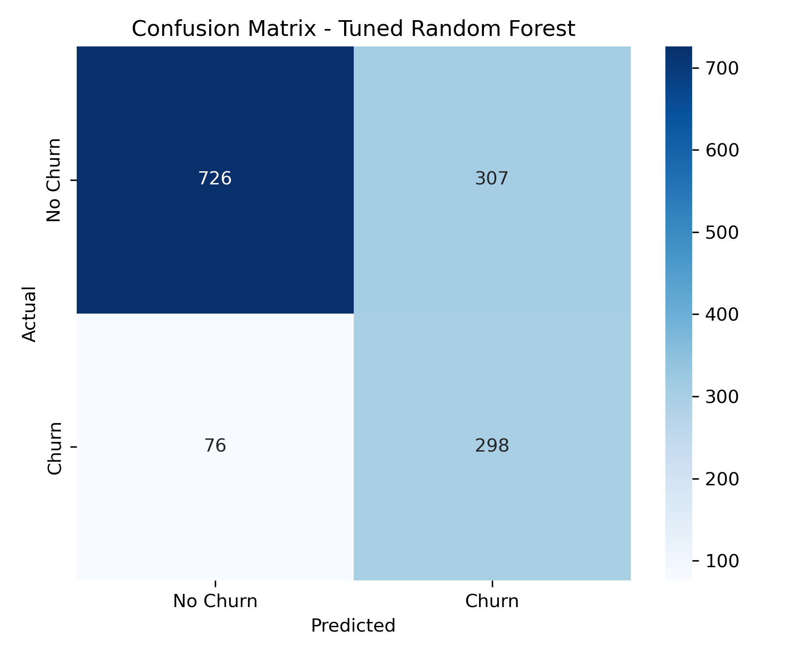
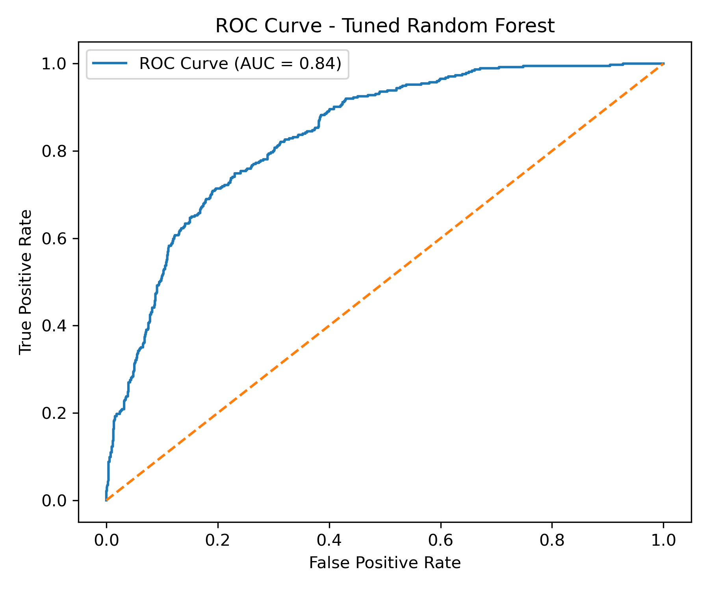

# 📉 Customer Churn Prediction System

An end-to-end machine learning system designed to predict customer churn in a telecom company.  
The project includes data preprocessing, model comparison, hyperparameter tuning, threshold optimization, SHAP explainability, and deployment using Streamlit.

## 🌐 Live Demo

[](https://your-streamlit-link-here)

# 1️⃣ Problem Statement

Customer churn represents one of the most significant revenue risks for subscription-based businesses. When customers cancel their services, companies lose recurring revenue and incur additional costs to acquire new customers.

In many telecom businesses:

- Customer acquisition is expensive.
- Retention is significantly cheaper.
- Identifying churn early can directly improve profitability.

However, churn is influenced by multiple interacting factors such as contract type, tenure, service usage, and billing structure.

The challenge is to build a predictive system that can:

- Identify customers at high risk of churn.
- Provide interpretable explanations.
- Align with business objectives (minimizing revenue loss).

# 2️⃣ Project Objective

The primary objective of this project is:

> To develop and deploy a machine learning model capable of predicting customer churn with strong recall performance while maintaining business interpretability.

Specific goals:

- Compare multiple classification models.
- Optimize hyperparameters.
- Tune decision thresholds based on business impact.
- Explain model predictions using SHAP.
- Deploy the final model in an interactive web application.

# 3️⃣ Dataset Description

**Dataset:** Telco Customer Churn Dataset (Kaggle)

- ~7,000 customer records
- 19 predictive features
- Binary target variable: `Churn` (Yes/No)

### Feature Categories

**Demographics**
- Gender
- Senior Citizen
- Partner
- Dependents

**Account & Contract Information**
- Tenure
- Contract type
- Paperless billing
- Payment method

**Service Usage**
- Phone service
- Internet service
- Online security
- Tech support
- Streaming services

**Billing**
- Monthly charges
- Total charges

The dataset exhibits class imbalance, with non-churners being the majority class.

# 4️⃣ Methodology

## 4.1 Data Cleaning

- Converted `TotalCharges` to numeric format.
- Verified and handled missing values.
- Removed unnecessary identifiers.
- Checked class distribution.

## 4.2 Exploratory Data Analysis (EDA)

Key exploratory findings:

- Month-to-month contracts show significantly higher churn rates.
- Customers with low tenure are more likely to churn.
- Higher monthly charges correlate positively with churn.
- Electronic check payment method is associated with higher churn.

Correlation analysis and churn-rate-by-category plots guided feature understanding.

## 4.3 Preprocessing Pipeline

A `ColumnTransformer` was used to:

- One-hot encode categorical features.
- Pass numeric features appropriately.
- Integrate preprocessing directly into the model pipeline.

This ensures:

- Reproducibility
- Deployment consistency
- No data leakage

## 4.4 Model Development & Comparison

Three models were trained and evaluated:

1. Logistic Regression (baseline model)
2. Random Forest
3. XGBoost

Evaluation metrics:

- Accuracy
- Precision
- Recall
- F1-score
- ROC-AUC

### Why Recall Matters

In churn prediction, false negatives (missed churners) are often more costly than false positives. Therefore, recall for the churn class was prioritized.

# 📊 Model Comparison

| Model                     | Accuracy | Precision (Churn) | Recall (Churn) | F1-Score | ROC-AUC |
|---------------------------|----------|-------------------|----------------|----------|----------|
| Logistic Regression       | 0.80     | 0.65              | 0.57           | 0.61     | 0.83     |
| XGBoost                   | 0.77     | 0.55              | 0.68           | 0.61     | 0.82     |
| **Tuned Random Forest**   | **0.73** | **0.49**          | **0.80**       | **0.61** | **0.84** |

*Performance varies slightly depending on threshold selection.

# 5️⃣ Hyperparameter Tuning

Random Forest was tuned using cross-validation with:

- n_estimators
- max_depth
- min_samples_split
- min_samples_leaf
- max_features

Best performing configuration resulted in:

- Controlled tree depth (reducing overfitting)
- Improved recall stability
- Better generalization

# 6️⃣ Threshold Optimization

The default threshold (0.5) was not assumed optimal.

Multiple thresholds (0.3, 0.4, 0.5, 0.6) were evaluated.

Lowering the threshold:

- Increased churn recall
- Captured more at-risk customers
- Slightly reduced precision

Financial analysis demonstrated that optimizing the decision threshold significantly reduces expected churn-related losses, even when accounting for increased false positives.

This step aligned the model with business objectives rather than pure statistical optimization.

# 7️⃣ Final Model Performance

**Selected Model:** Tuned Random Forest

Test set performance:

- ROC-AUC ≈ 0.84
- Recall (Churn) ≈ 0.80
- Balanced macro-average performance

The tuned Random Forest demonstrated:

- Strong ranking ability
- Robust recall
- Controlled overfitting

# 📈 Model Performance Visualizations

## Confusion Matrix



## ROC Curve



# 8️⃣ Model Explainability (SHAP)

SHAP (SHapley Additive Explanations) was used to:

- Quantify global feature importance.
- Explain individual predictions.

## Global SHAP Insights

Top drivers increasing churn probability:

- Month-to-month contracts
- Low tenure
- High monthly charges
- Fiber optic internet
- Electronic check payment method

Top drivers reducing churn probability:

- Long-term contracts (1-year / 2-year)
- Higher tenure

These findings provide actionable business insights for targeted retention strategies and enhance stakeholder trust and supports actionable decision-making.

## 🔄 System Architecture


# 9️⃣ Deployment

The final model was deployed using Streamlit.

The web app allows users to:

- Input customer details
- Adjust classification threshold
- View churn probability
- See SHAP explanation for predictions

# 💡 Key Business Takeaways

- Contract structure strongly influences churn behavior.
- Early-stage customers are highest risk.
- Billing structure plays a behavioral role in churn.
- Targeted intervention at optimized thresholds improves retention capture.
- Explainability increases stakeholder confidence in automated decision systems.

By optimizing the threshold, the model prioritizes business-sensitive recall over default accuracy.

# ⚙ Technical Highlights

- End-to-end ML pipeline using ColumnTransformer
- Hyperparameter tuning with cross-validation
- Threshold optimization aligned with business costs
- SHAP global and local explainability
- Production-ready Streamlit deployment
- Clean project structuring for reproducibility

# 🔟 Limitations

- Single dataset (no external validation)
- Static dataset (no time-based drift modeling)
- Financial impact assumptions illustrative
- No real-time production monitoring

# 1️⃣1️⃣ Recommendations for Future Work

- Time-aware validation
- Cost-sensitive learning
- Model monitoring for drift
- Ensemble stacking approaches
- Integration into CRM systems

## 📂 Project Structure

```text
churn-project/
│
├── app.py
├── tuned_random_forest_pipeline.pkl
├── shap_summary.png
├── requirements.txt
├── README.md
│
├── notebooks/
│   └── customer_churn_prediction.ipynb
│
└── assets/
    ├── confusion_matrix.png
    └── roc_curve.png

Overall, this project demonstrates the importance of model comparison, threshold optimization, and explainability in building deployable, business-aligned machine learning systems.

Run locally:

```bash
pip install -r requirements.txt
streamlit run app.py